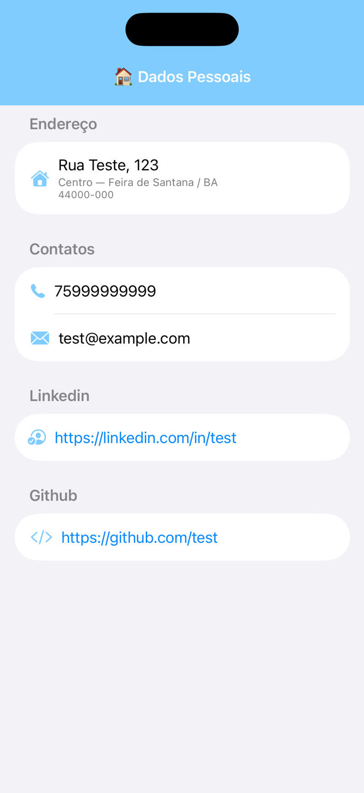

# Curriculum App 🧑🏽‍💻

Este projeto é um aplicativo Android nativo que apresenta o currículo profissional de **Joel de Almeida Souza**. Ele foi migrado de uma versão original em iOS, mantendo a fidelidade visual e a arquitetura robusta.

## 📱 Telas

| Home | Dados Pessoais |
| :---: | :---: |
|  |  |

## 🚀 Funcionalidades

- **Visão Geral**: Acesso rápido às seções do currículo através de um grid interativo.
- **Dados Pessoais**: Exibição detalhada de endereço, contatos e links sociais.
- **Integração Externa**: Abertura direta de perfis no LinkedIn e GitHub via navegador.
- **Networking**: Consumo de dados via API RESTful com tratamento de estados (Loading, Success, Error).

## 🏗️ Arquitetura e Tecnologias

O aplicativo segue os princípios modernos de desenvolvimento Android:

- **MVVM (Model-View-ViewModel)**: Separação clara entre a lógica de negócio e a interface de usuário.
- **Jetpack Compose**: Interface de usuário declarativa e moderna.
- **Navigation Compose**: Gerenciamento centralizado de rotas e navegação.
- **Retrofit & GSON**: Comunicação com API e parsing de JSON.
- **Coroutines & StateFlow**: Gerenciamento de fluxos assíncronos e estados da UI de forma reativa.
- **Material 3**: Design system atualizado para uma experiência de usuário consistente.

## 🛠️ Como rodar o projeto

1. **Pré-requisitos**:
   - Android Studio Jellyfish ou superior.
   - JDK 17+.
   - Conexão com a internet para sincronização do Gradle e acesso à API.

2. **Passo a passo**:
   - Clone o repositório: `git clone https://github.com/joelsouza82/curriculum.git`
   - Abra o Android Studio.
   - Vá em `File > Open` e selecione a pasta do projeto.
   - Aguarde o Gradle sincronizar todas as dependências.
   - Conecte um dispositivo físico ou inicie um emulador (API 24+).
   - Clique no botão **Run** (ícone de play verde) no topo do Android Studio.

